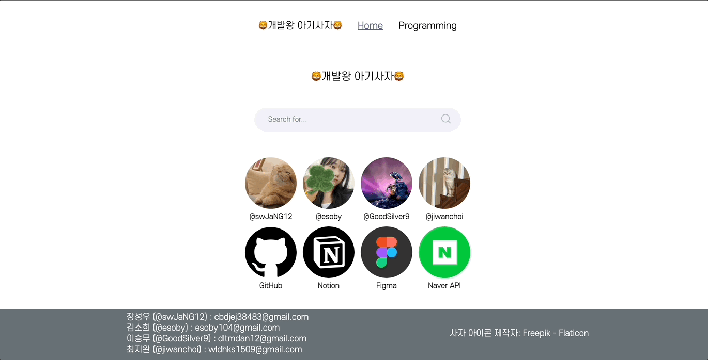
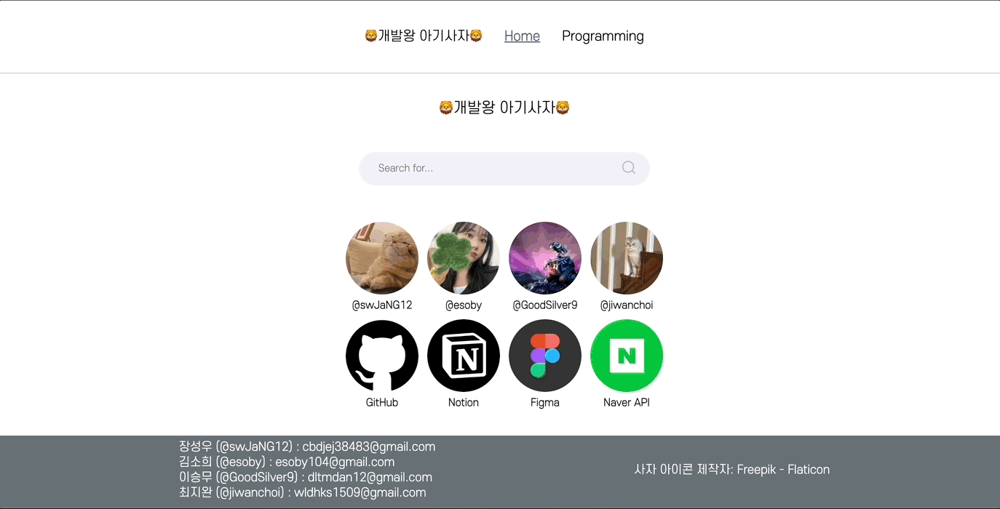
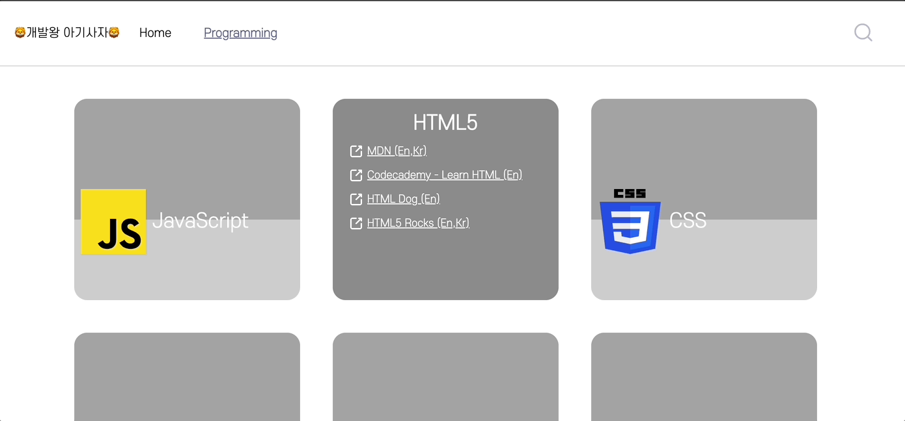
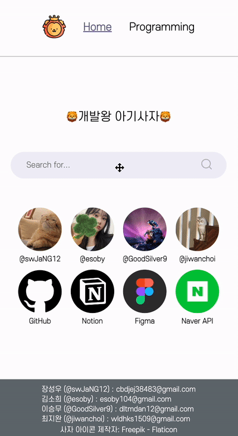
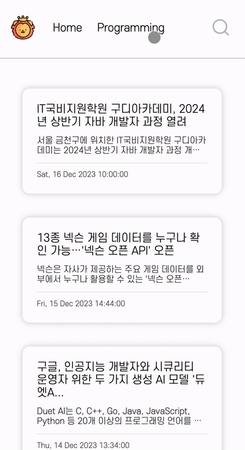
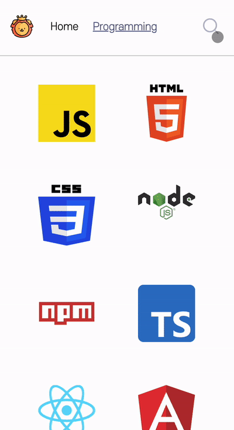

<h1 align="">🦁개발왕 아기사자🦁</h1>

<!--  -->

### 📍 배포 링크

[🦁개발왕 아기사자🦁](https://devkingbabylion.netlify.app/ '바로가기')

 

## 1. 프로젝트 소개

<em>개발왕을 꿈꾸는 아기사자의 개발 공부 노트입니다.</em>

- 네이버 api를 이용한 뉴스 검색 기능으로 최신 개발 동향을 파악하자!

- 원하는 기술 스택의 프로그래밍 카드를 뒤집어 빠르게 정보를 얻자!

 

## 2. 팀 소개

우리의 인연은 멋사 프론트엔드스쿨 7기, 아기사자 코테 스터디로부터 ...

<table>
  <tbody>
    <tr>
      <td align="center"><a href="https://github.com/swJaNG12"> <b>팀장 장성우</b></a> </td>
      <td align="center"><a href="https://github.com/esoby"> <b>김소희</b></a> </td>
      <td align="center"><a href="https://github.com/GoodSilver9"> <b>이승무</b></a> </td>
      <td align="center"><a href="https://github.com/jiwanchoi"> <b>최지완</b></a> </td>
    </tr>
  </tbody>
</table>

 

## 3. 역할 분담

| 공동                                    | 장성우                                                                                                                                                     | 김소희                                                                                                                                        | 이승무                                                                                                                                           | 최지완                                                                                                                                                               |
| --------------------------------------- | ---------------------------------------------------------------------------------------------------------------------------------------------------------- | --------------------------------------------------------------------------------------------------------------------------------------------- | ------------------------------------------------------------------------------------------------------------------------------------------------ | -------------------------------------------------------------------------------------------------------------------------------------------------------------------- |
| 📝 회의록 작성   🎨 피그마 UI 디자인 | ✨ 프로젝트 초기 세팅   ✨ netlify serverless function 구현   ✨ Home 페이지 성능 점수 개선   🐛 전반적인 프로젝트 버그 픽스   ✨ netlify 배포 | ✨ 홈 링크 컴포넌트 구현   ✨ 뉴스 카드 컴포넌트 구현   ✨ Search 페이지 무한 스크롤 구현   🎨 프로그래밍, Search 페이지 반응형 구현 | ✨ 프로그래밍 카드 컴포넌트 구현   🎨 Search 페이지 구현  ♻️ Programming 페이지 light-house 성능 점수 개선   📝 Git 기술 자문 및 가이드 | ✨ 네이버 검색 api 연결   ✨ Header, Footer 컴포넌트 구현   ✨ 검색 input 컴포넌트 구현   🎨 프로그래밍 페이지 구현   ♻️ Header 기능 개선 및 반응형 구현 |

 

## 4. 개발 기간 (23.11.27 ~ 23.12.17)

| 주차  |                                                                                                     |
| ----- | --------------------------------------------------------------------------------------------------- |
| 1주차 | - 주제 선정, 기술 스택 및 협업툴 선정, 컨벤션 정리   - Figma UI 디자인 작업, 기능 요구사항 명세 |
| 2주차 | - 네이버 검색 API 기능 구현   - 페이지별 UI 구현                                                |
| 3주차 | - 기능별 테스트 후 테스트 케이스 작성 및 보완   - 성능 개선 리팩토링 및 반응형 구현             |

 

## 5. 협업

  

    
    
    
    
  

<em> 👉🏻 로고 클릭 시 해당 링크로 이동합니다! </em>
 
 
 

## 6. 개발 환경

### 🛠 기술 스택

  
  
  
  
  
  

### 📋 컨벤션

### Branch name 컨벤션

1. **기능 브랜치 (Feature Branches)**:
   - **`이슈번호-feature-기능명`** 과 같은 형식을 사용합니다.
   - 예: **`42-feature-dashboard-widget`**
2. **버그 수정 브랜치 (Bugfix Branches)**:
   - **`이슈번호-bugfix-버그명`** 과 같은 형식을 사용합니다.
   - 예: **`53-bugfix-login-issue`**
3. **리펙토링 브랜치 (Refactoring Branches)**:

   - **`이슈번호-refactor-리펙토링명`** 과 같은 형식을 사용합니다.
   - 예: **`55-refactor-search-page`**

### Commit 컨벤션

| 제목                | 설명                                                                                       |
| :------------------ | :----------------------------------------------------------------------------------------- |
| ✨feat:             | 기능 추가, 삭제, 변경                                                                      |
| 🐛fix:              | 버그, 오류 수정                                                                            |
| 📝docs:             | readme.md, json 파일 등 수정, 라이브러리 설치 (문서 관련, 코드 수정 없음)                  |
| 🎨style:            | CSS 등 사용자 UI 디자인 변경, 코드 formatting, 세미콜론 누락, 코드 자체의 변경이 없는 경우 |
| ♻️refactor:         | 코드 리팩토링                                                                              |
| 🧪test:             | 테스트 코드, 리팩토링 테스트 코드 추가                                                     |
| 🌱chore:            | 패키지 매니저 수정, 그 외 기타 수정 ex) .gitignore                                         |
| 💬comment:          | 필요한 주석 추가 및 변경                                                                   |
| 🚚rename:           | 파일 또는 폴더 명을 수정하거나 옮기는 작업만인 경우                                        |
| 🗑remove:           | 파일을 삭제하는 작업만 수행한 경우                                                         |
| 🛠!BREAKING CHANGE: | 커다란 API 변경의 경우                                                                     |
| 🔥!HOTFIX:          | 급하게 치명적인 버그를 고쳐야 하는 경우                                                    |

 

## 8. 기능 시연

### 🖥 PC 화면

<table>
  <tr>
    <th width="30%">홈 화면 & 검색 & 무한 스크롤</th>
    <th width="30%">프로그래밍 페이지</th>
    <th width="30%">Header로 검색</th>
  </tr>
  <tr>

  <td></td>
  <td></td>
  <td></td>
  </tr>
</table>

 

### 📱 모바일 화면

<table>
  <tr>
    <th width="30%">홈 화면 & 검색 & 무한 스크롤</th>
    <th width="30%">프로그래밍 페이지</th>
    <th width="30%">Header로 검색</th>
  </tr>
  <tr>

  <td></td>
  <td></td>
  <td></td>
  </tr>
</table>

 

## 9. ♻️ Refactoring

[<a href="https://www.notion.so/922f5d23f2f94c169b65cd5cf70316f8?v=f709f88318a544fe89b6274c3b3a641d">✍🏻 Refactoring</a>]
